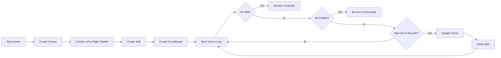

# 🏓 Pong Game (Python)


A classic **Pong Arcade Game** recreated in **Python** using the built-in **Turtle Graphics** library.

This project recreates one of the most iconic arcade games while demonstrating **Object-Oriented Programming (OOP), collision detection, animation, keyboard event handling, game loops, score tracking, and modular programming**.

---

# 📌 Table of Contents

- 🚀 Features
- 🏓 About Pong
- 🎮 Gameplay
- ⚙️ Game Workflow
- 📂 Project Structure
- 🛠️ Tech Stack
- ▶️ How to Run
- 🎮 Controls
- 📸 Gameplay Preview
- 🧠 Collision Detection
- 📊 Score System
- 🎯 Learning Outcomes
- 🔮 Future Improvements
- 🤝 Contributing
- 📜 License
- 👨‍💻 Author
- ⭐ Support

---

# 🚀 Features

| Feature | Description |
|----------|-------------|
| 🎮 Two Player Mode | Play with a friend |
| 🏓 Smooth Paddle Controls | Responsive keyboard movement |
| ⚡ Real-time Ball Movement | Smooth animation using Turtle Graphics |
| 💥 Paddle Collision | Ball bounces realistically |
| 🧱 Wall Collision | Ball reflects from top & bottom |
| 📊 Live Scoreboard | Tracks scores in real time |
| 🔄 Ball Reset | Automatically resets after every point |
| 🧩 Object-Oriented Design | Modular and reusable code structure |
| 🎨 Colorful UI | Simple yet engaging Turtle Graphics interface |

---

# 🏓 About Pong

**Pong** is one of the earliest arcade video games ever created.

Two players control paddles positioned on opposite sides of the screen. Their objective is to prevent the ball from passing their paddle while attempting to score against their opponent.

The game continues until players decide to stop, with scores updating in real time.

---

# 🎮 Gameplay

Each player controls a paddle.

The ball continuously moves across the screen.

Whenever:

- 🧱 The ball touches the top or bottom wall → it bounces back.
- 🏓 The ball hits a paddle → it changes direction.
- ❌ The ball crosses a player's boundary → the opponent scores.
- 🔄 The ball resets to the center after every point.

---

# ⚙️ Game Workflow



---

# 📂 Project Structure

```text
Pong-Game/
│
├── main.py          # Main game loop
├── paddle.py        # Paddle class
├── ball.py          # Ball movement & collision
├── scoreboard.py    # Score tracking
├── README.md
```

---

# 🛠️ Tech Stack

| ⚙️ Technology | 💡 Purpose |
|---------------|------------|
| 🐍 Python 3 | Main programming language |
| 🐢 Turtle Graphics | Rendering the game |
| 🧩 Object-Oriented Programming | Modular code structure |
| 🔁 Game Loop | Continuous gameplay |
| ⌨️ Keyboard Events | Paddle controls |
| ⚡ Collision Detection | Ball interactions |
| 📊 Score Management | Track player scores |

---

# ▶️ How to Run

| 🚀 Step | 💻 Command | 📌 Description |
|---------|------------|----------------|
| 1️⃣ Clone Repository | `git clone https://github.com/yourusername/pong-game.git` | Download the project |
| 2️⃣ Open Folder | `cd pong-game` | Navigate to project |
| 3️⃣ Run Game | `python main.py` | Launch the Pong Game |

---

# 🎮 Controls

| Player | Move Up | Move Down |
|----------|---------|-----------|
| 🔵 Left Player | **W** | **S** |
| 🔴 Right Player | **↑ Arrow** | **↓ Arrow** |

---

# 📸 Gameplay Preview

> 📷 Add a screenshot or GIF of your gameplay here.

Example:

```
 Player 1                 Player 2

     3          |          2

 █                 ●                 █
 █                                   █
 █                                   █
 █                                   █
 █                                   █
```

---

# 🧠 Collision Detection

The game continuously checks for three different collision types.

| Collision Type | Action |
|----------------|--------|
| 🏓 Paddle Collision | Ball reverses horizontal direction |
| 🧱 Wall Collision | Ball reverses vertical direction |
| ❌ Missed Paddle | Opponent earns one point |

This creates smooth and realistic gameplay.

---

# 📊 Score System

The scoreboard updates instantly whenever a player scores.

Example:

```text
Player 1 : 5

Player 2 : 3
```

Whenever the ball crosses either boundary:

- Opponent receives one point.
- Ball resets to the center.
- Match resumes immediately.

---

# 🎯 Learning Outcomes

| 📚 Concept | 💡 What I Learned |
|------------|------------------|
| 🧩 Classes & Objects | Creating reusable game components |
| 🏗️ Object-Oriented Programming | Designing modular applications |
| 🔄 Game Loop | Continuous rendering and updates |
| 🎮 Keyboard Events | Player interaction |
| ⚡ Collision Detection | Ball physics |
| 📊 State Management | Score tracking |
| 🐢 Turtle Graphics | Building graphical applications |

> 💡 **This project strengthened my understanding of Object-Oriented Programming, collision detection, event handling, animation, and game development fundamentals using Python.**

---

# 🔮 Future Improvements

- 🤖 Single Player AI
- 🔊 Sound Effects
- ⏸️ Pause & Resume
- 🏆 Winning Score Limit
- 🌈 Better Graphics
- 🎨 Improved Animations
- 📱 Responsive Window Scaling
- ⚙️ Difficulty Levels
- 🌐 Online Multiplayer
- 🎮 Pygame Version

---

# 🤝 Contributing

Contributions are always welcome!

Whether you're learning Python or want to improve the game, feel free to contribute.

## Steps To Contribute

- 🍴 Fork this repository
- 🌿 Create a new branch
- 💻 Implement your improvements
- ✅ Commit your changes
- 🚀 Submit a Pull Request

Let's build and learn together!

---

# 📜 License

<div align="center">

## 🛡️ MIT License

This project is licensed under the MIT License.

</div>

---

### 🔓 What This Means

- ✅ Use the project freely
- ✅ Modify the source code
- ✅ Share your own versions
- ✅ Use commercially

Just provide proper attribution.

---

# 👨‍💻 Author

<div align="center">

## Prem Kumar

🎓 B.Tech Computer Science Engineering Student

💡 Passionate about Programming, Software Development, Problem Solving, and Building Real-World Projects.

</div>

---

### 🌟 About Me

- 🎓 Computer Science Student
- 🐍 Learning Python and Software Development
- 🚀 Building projects to strengthen problem-solving skills
- 💡 Exploring technology through practical projects

> *"Keep building. Keep learning. Keep going beyond."*

---

# ⭐ Support

<div align="center">

## 💙 Show Your Support

If you found this project helpful or interesting, consider supporting it.

</div>

---

### 🚀 Ways To Support

- ⭐ Star this repository
- 🍴 Fork the project
- 🛠️ Contribute improvements
- 📢 Share it with other learners

---

✨ Every star motivates me to keep building, learning, and sharing more projects with the community.
